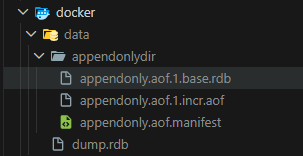

# 레디스 데이터 백업 방법

레디스에서 모든 데이터는 메모리에서 관리한다.

레디스 인스턴스 혹은 레디스가 실행되는 서버의 장애로 인해 레디스 인스턴스가 재시작될 경우 메모리에 상주해 있던 레디스의 모든 데이터는 손실될 가능성이 있다. 데이터 유실을 방지하기 위해서 주기적으로 백업하는 것이 안전하다. 백업하는 방식으로는 RDB와 AOF 두 가지의 백업 방식을 지원한다.

> [!NOTE]
> 백업과 복제는 목적이 다르다.

- AOF (Append Only File) : 레디스 인스턴스가 처리한 모든 `쓰기 작업` 을 차례대로 기록한다. 복원 시에는 파일을 다시 읽어가며 데이터 세트 재구성
- RDB (Redis Database) : 일정 시점에 메모리에 저장된 데이터 전체를 저장(snapshot 방식)


RDB 파일은 바이너리 형태로 저장돼 해석할 수 없는 형태이며, AOF 파일은 레디스 프로토콜 RESP 형태로 저장된다.

AOF 파일에는 레디스에서 실행된 모든 `쓰기 작업`이 기록된다. 특정 key 의 value 데이터가 다른 값으로 변경된 내역, 새로운 키가 생성됐다가 삭제된 내역 모두 AOF 파일에 기록된다. 따라서 AOF 파일을 처음부터 끝까지 따라가면 원본 데이터에 도달할 수 있다.

RDB 파일에는 저장되는 시점의 메모리 데이터가 그대로 저장된다. 저장한 시점의 스냅샷 데이터만 저장된다.

각 방식은 모두 장단점을 갖고 있다. RDB 방식은 시점 단위로 여러 백업본을 저장할 수 있고, AOF 파일보다 복원이 빠르다는 장점이 있지만 특정 시점으로의 복구는 불가능하다.
AOF는 RDB 파일보다 크기가 크고 주기적으로 압축해 작성해야 하지만, 원하는 시점으로 복구할 수 있다는 장점이 있다.

레디스에서 데이터를 복원할 수 있는 시점은 서버가 재시작될 때뿐이며, 실행 도중에 데이터 파일을 읽어올 수 있는 방법은 없다. 레디스 서버는 재시작될 때 AOF 파일이나 RDB 파일이 존재하는지 확인한 뒤, 파일이 있을 때에는 파일을 로드한다. 레디스는 RDB 파일보다 AOF 파일이 더 내구성이 보장된다고 판단하기 때문에 2개의 파일이 모두 존재할 때에는 AOF의 데이터를 로드한다.

## RDB 방식의 데이터 백업

RDB 파일은 원하는 시점에 메모리 자체를 스냅숏 찍듯 저장할 수 있기 때문에 백업에 적합한 파일 형태라고 볼 수 있다.

원하는 시간에 RDB 파일을 생성할 수 있으며, 장애 발생 시 RDB 파일이 존재하는 시점으로 데이터를 복원할 수 있다. 파일을 옮겨 원격 저장소에 2차 백업을 수행한다면 데이터 센터 장애 등 더 큰 장애에도 대처할 수 있다.

하지만 장애가 발생했을 때 손실 가능성을 최소화해야 하는 서비스에는 RDB 파일을 이용한 백업만 사용하는 것은 적절하지 않다. 저장 시점부터 장애가 발생한 직전까지의 데이터는 손실될 수 있다.

RDB 파일을 생성할 수 있는 세 가지 방법

1. 설정 파일에서 특정 조건에 파일이 자동으로 저장되도록 저장한다.
2. 사용자가 원하는 시점에 커맨드를 이용해 수동으로 파일을 생성한다.
3. 복제 기능을 사용한다면 레디스는 자동으로 RDB 파일을 생성한다.

### 특정 조건에 자동으로 RDB 파일 생성

```
save <기간(초)> <기간 내 변경된 키의 개수>
dbfilename <RDB 파일 이름>
dir <RDB 파일이 저장될 경로>
```

레디스 설정 파일에서 `save` 옵션을 사용해 원하는 조건에 RDB 파일을 저장하도록 설정한다. 조건에 맞을 때 레디스 서버는 자동으로 RDB 파일을 저장한다.

RDB 파일은 dbfilename 옵션에 지정된 이름으로 생성되며, 기본 값은 dump.rdb이다. 파일은 dir에 지정한 경로에 저장된다.



### 수동으로 RDB 파일 생성

`SAVE`, `RGSAVE` 커맨드를 이용하면 원하는 시점에 직접 RDB 파일을 생성할 수 있다. 두 커맨드 모두 실행 시점의 메모리 스냅숏을 생성하는 커맨드이지만 동작하는 방식에 차이가 있다.

`SAVE` 커맨드는 동기 방식으로 파일을 저장한다. 커맨드를 실행하면 파일 생성이 완료될 때까지 모든 다른 클라이언트의 명령을 차단한다. 일반적인 운영 환경에서는 `SAVE` 커맨드를 사용하지 않는 것이 좋다.

`RGSAVE` 는 fork를 호출해 자식 프로세스를 생성하며 백그라운드에서 RDB 파일을 생성한 뒤 종료된다. 만약 이미 저장 중이라면 에러를 반환한다. `SCHEDULE` 옵션을 사용해 이전 작업이 완료된 이후에 다시 실행된다.

RDB 파일이 정상적으로 저장됐는지 `LASTSAVE` 커맨드로 확인할 수 있으며 저장된 시점을 유닉스 타임스탬프로 반환한다.

### 복제를 사용할 경우 자동으로 RDB 파일 생성

복제본에서 `REPLICAOF` 커맨드를 이용해 복제를 요청하면 마스터 노드에서는 RDB 파일을 새로 생성해 복제본에 전달한다.

## AOF 방식의 데이터 백업

AOF는 수행된 모든 쓰기 작업의 로그를 차례로 기록한다. 설정 파일에서 appendonly 옵셥을 yes로 설정하면 AOF 파일에 주기적으로 데이터가 저장된다.

AOF 에서 모든 커맨드의 실행 내역은 레디스 프로토콜 RESP 형식으로 저장된다.

AOF는 Append-Only File 이라는 이름 뜻 그래도 실행되는 커맨드가 파일의 뒤쪽에 계속 추가되는 방식으로 동작한다.

> 실수로 FLUSHALL 커맨드로 데이터를 날렸더라도 AOF파일을 직접 열어 해당 커맨드만 삭제한 뒤 레디스를 재시작시킨다면 데이터를 바로 복구할 수 있다.

설정 파일

```
appendonly yes
appendfilename "appendonly.aof"
appenddirname "appendonlydir"
```

레디스 프로토콜 (RESP) 형식

```
*2
$6
SELECT
$1
0
*3
$3
set
$5
hello
$5
world
*2
$6
```

### AOF 파일을 재구성하는 방법

인스턴스가 실행되는 시간에 비례해서 파일의 크기가 증가한다. 따라서 AOF 파일을 이용한 백업 기능을 안정적으로 사용하려면 점점 커지는 파일을 주기적으로 압축시키는 재구성 작업이 필요하다.

재구성 (rewrite) 작업 : 점점 커지는 파일을 주기적으로 압축시키는 작업

RDB에서와 마찬가지로 특정 조건에 자동으로 재구성되도록 설정할 수도 있으며, 사용자가 우너하는 시점에 커맨드를 이용해 재구성시킬 수 있다.

버전 7 이후에서 AOF는 기본이 되는 바이너리 형태의 RDB 파일, 증가하는 RESP의 텍스트 형태의 AOF 파일로 나눠서 데이터를 관리한다.

AOF가 재구성될 때마다 AOF를 구성하고 있는 각 RDB와 AOF의 파일명의 번호 그리고 매니페스트 파일 내부의 seq 값도 1씩 증가한다.

재구성 동작 흐름

1. 레디스 인스턴스는 fork를 이용해 자식 프로세스를 생성한다. 생성된 자식 프로세스는 레디스 메모리의 데이터를 읽어와 신규로 생성한 임시 파일에 저장된다. (appendonly.aof.n.base.rdb)
2. 백그라운드로 (1)의 과정이 진행되는 동안 레디스 메모리의 데이터가 변경된 내역은 신규 AOF 파일에 저장된다. (appendonly.aof.n.incr.aof)
3. (1)의 AOF 재구성 과정이 끝나면 임시 매니페스트 파일을 생성한 뒤, 변경된 버전으로 매니페스트 파일 내용을 업데이트한다.
4. 생성된 임시 매니페스트 파일로 기존 매니페스트 파일을 덮어 쓴 뒤, 이전 버전의 AOF, RDB 파일들을 삭제한다.

AOF 파일의 재구성 과정은 모두 순차 입출력만 사용하기 때문에 디스크에 접근하는 모든 과정이 굉장히 효율적이다. 레디스의 서버는 복원 시 순차적으로 데이터르 로드하는 용도로만 AOF 파일을 사용한다.

파일 내에서 직접 데이터를 검색할 필요가 없기 때문에 랜덤 입출력을 고려할 이유가 없다.

### 자동 AOF 재구성

```
auto-aof-rewrite-percentage 100
auto-aof-rewrite-min-size 64mb
```

`auto-aof-rewrite-percentage 100` 는 AOF 파일을 다시 쓰기 위한 시점을 정하기 위한 옵션이다. 마지막으로 구성됐던 AOF 파일의 크기와 비교해, 현재의 AOF 파일이 지정된 퍼센트만큼 커졌을 때 재구성을 시도한다. 마지막으로 저장된 AOF 파일의 크기는 레디스에서 INFO Persistence 커맨드로 확인할 수 있는 `aof_base_size` 값이다.

```
> INFO Persistence
# Persistence
...
aof_current_size:186830
aof_base_size:145802
...
```

현재 base 크기는 145802고 current size는 186830이다. 퍼센트가 100이라면 base_size가 100% 커진 291640 크기가 되면 자동으로 재구성을 시도한다.
